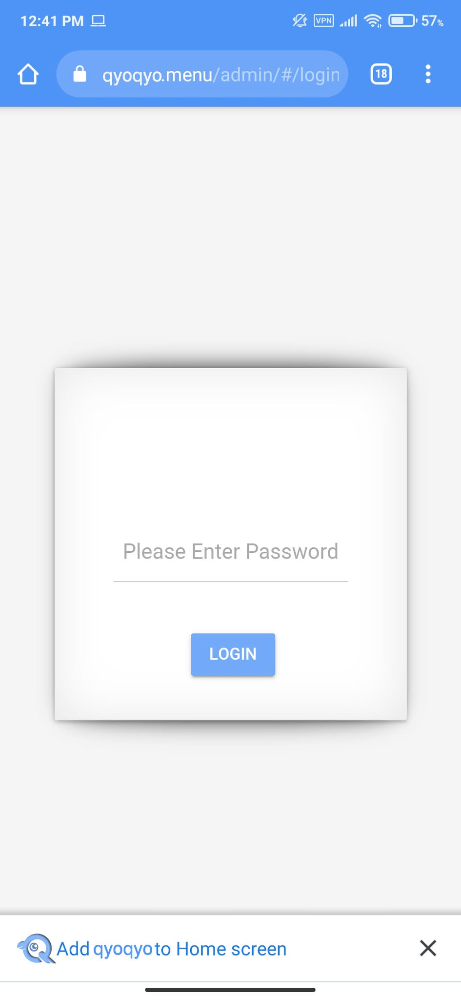
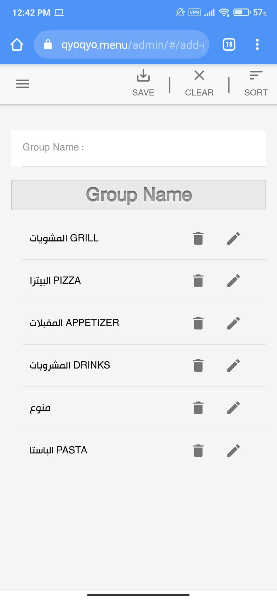
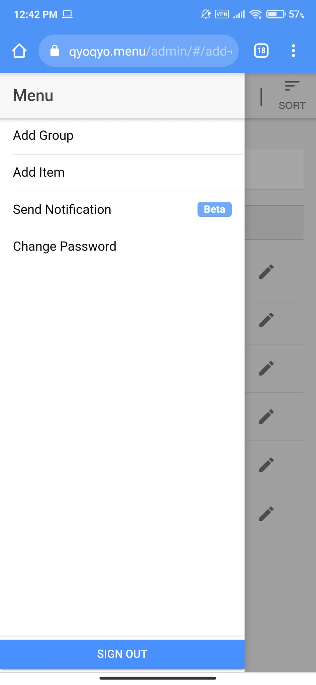
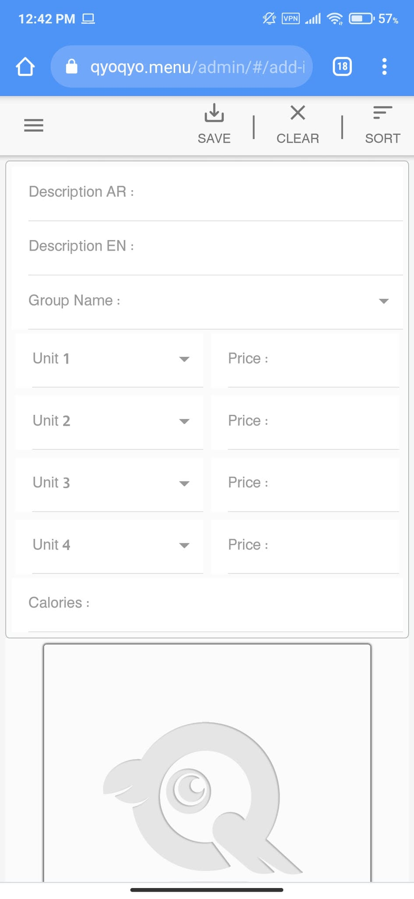
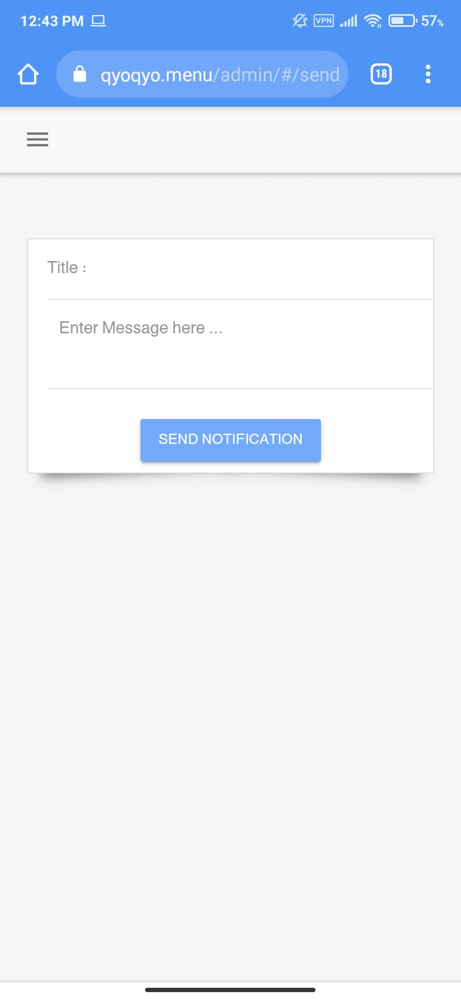
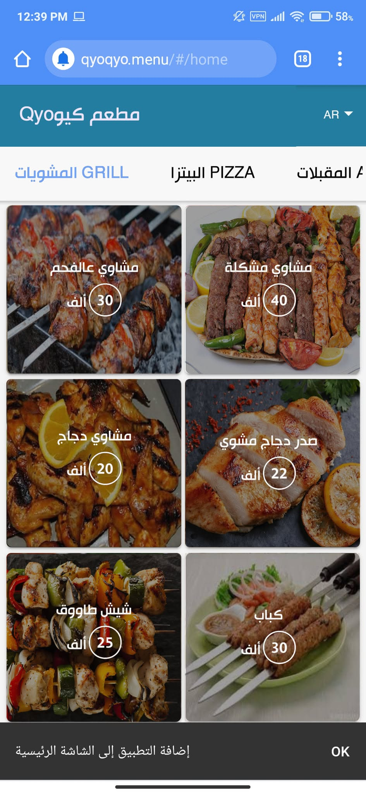

# 🍽️ Digital Menu App

A QR-code-based digital menu system for restaurants — customers scan a QR code to browse the menu and place orders directly from their device.

---

## 📸 Screenshots

<table>
  <tr>
    <td></td>
    <td></td>
    <td></td>
  </tr>
  <tr>
    <td></td>
    <td></td>
    <td></td>
  </tr>
</table>

---

## ✨ Features

- 📱 QR code scanning to access the menu
- 🍕 Browse menu categories and items
- 🛒 Place orders directly from the device
- 🖼️ Display item images and descriptions
- 💬 Arabic & multilingual support

---

## 🛠️ Technologies

| Technology | Usage |
|------------|-------|
| Ionic | Frontend Framework |
| Angular | UI Components |
| TypeScript | Programming Language |
| SCSS | Styling |
| Firebase | Database |

---

## 👨‍💻 Developer

**Mustafa Alkateb** — Software Developer · Web & Mobile  
🔗 [github.com/steefalkateb](https://github.com/steefalkateb)
